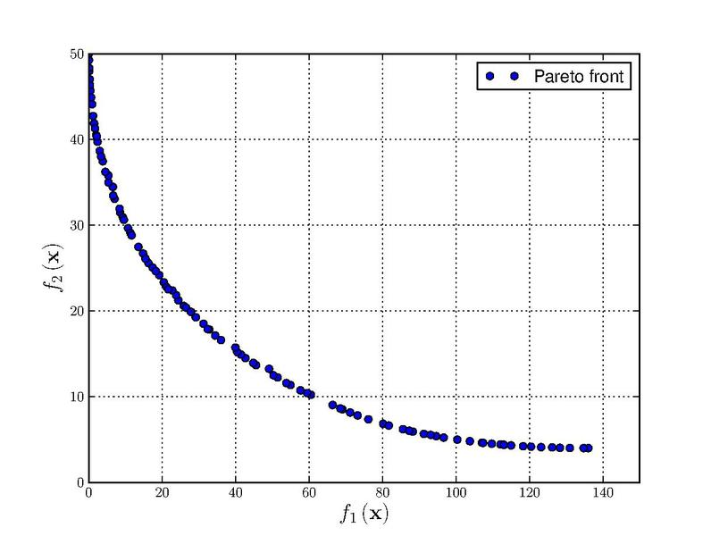
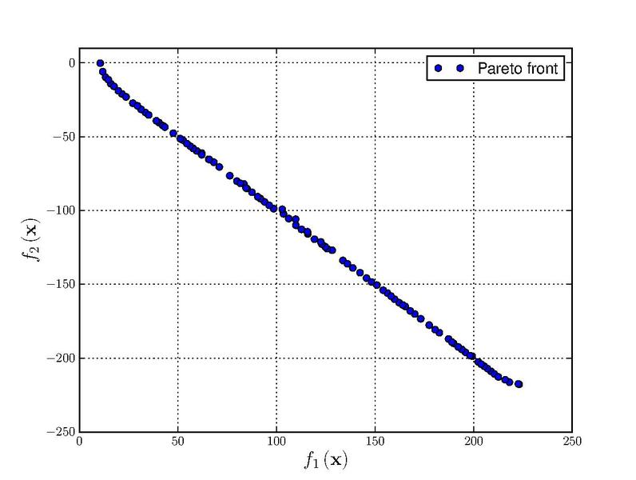
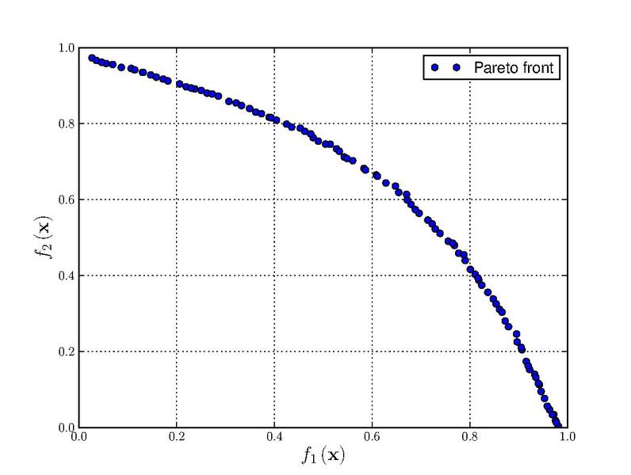
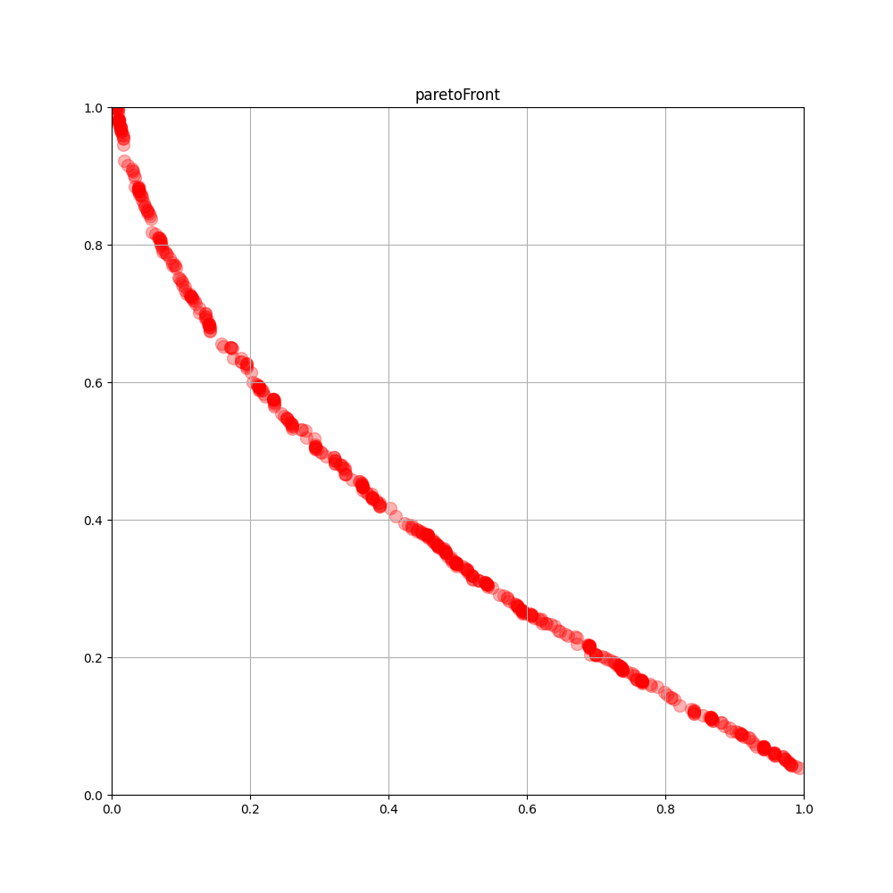

# Algorytm sawanna do optymalizacji wielkryterialnej funkcji z ograniczeniami

Algorytm został wymyślony przeze mnie, porzucony z powodu długiego czasu działania w porównaniu z innymi takimi jak NSGA-II.

## Działanie algorytmu

Algorytm powstał na bazie inspiracji migracją antylopy gnu na sawannie. Stada tej antylopy wraz z zebrami oraz gazellami podróżują każdego roku w celu poszukiwania jedzenia. Podczas tej wędrówki wiele osobników ginie z powodu rwących rzek bądź ataków drapieżników.\

Na początku należy zdefiniować funkcje np. w postaci lambda funkcji, które mają być minimalizowane oraz ograniczenia w postacji w takiej samej postaci, które będą sprawdzane, czy są nie większe niż zero np.:
```
f1 = lambda x: x[0]**2-x[1]
f2 = lambda x: -0.5*x[0]-x[1]-1

g1 = lambda x: -6.5 + x[0]/6 + x[1]
g2 = lambda x: -7.5 + 0.5*x[0] + x[1]
g3 = lambda x: -30 + 5*x[0] + x[1]

functions = [f1, f2]
constraints = [g1, g2, g3]
```
Następnie należy określić granice dla każdej zmiennej np.:
```
lims = [[-7,4], [-7,4]]
```
Do tego celu można wykorzystać inny sposób generowania listy, aby to zautomatyzować np.:
```
lims = [[-7,4] for i in range(2)]
```
Parametry algorytmu to liczba cykli, ilość poszczególnych zwierząt w stadzie oraz liczba drapieżników.
```
maxCycles = 1200

wildebeest = 120
zebras = 25
gazelles = 10
predators = 4
```
Dodatkowymi parametrami są odległość poszukiwanych rozwiązań przez gazele oraz liczba przedziałów histogramu.
```
epsylon = gazellaSearchArea = standardDeviation = 0.01
bins = areaExplore = 20
```
Algorytm wykonuje następujące krok określoną liczbę razy (liczba cykli):\
1. Wybierz cel dla stada. \
Jeżeli jest to pierwsza iteracja cel wybierany jest losowo (są to wartości argumentów funkcji np. x1 = 1, x2 = 3\
Jeżeli jest to kolejna iteracja cel wybierany jest w następujący sposób:\
- Wylosuj według wartości której funkcji (f1, f2, ...) obrany będzie cel stada\
- Na podstawie znalezionych obecnie najlepszych rozwiązań stwórz histogram tej wartości\
- Wylicz prawdopobieństwo wyboru każdego przedziału na podstawie $1/d$, gdzie `d` to liczba wartości w danym przedziale. Jeżeli `d=0`, to wtedy prawdopobieństwo wynosi 0\
- Znormalizuj je, aby suma wartości $1/d$ wynosiła 1\
- Wybierz pewien przedział, a następnie wylosuj z niego jedno rozwiązanie, to ono będzie celem stada\
2. Wylosuj położenie startowe stada np. x1=0, x2=0\
3. Utwórz populację we wskazanej lokalizacji składającą się z odpowiedniej liczby antylop gnu, zebr i gazelli\
4. Dopóki jakieś zwierzęta żyją wykonuj następujące kroki:\
- Oceń rozwiązanie reprezentowane przez każde zwierzę i zaaktualizuj listę rozwiązań optymalnych\
Konieczne sprawdź czy wartości x1, x2, ..., mieszczą się w ograniczeniach i granicach.\
- Porusz każde zwierze w przestrzeni x1, x2, ... zgodnie z zasadami dla danego gatunku\
Przyjęte przeze mnie rodzaje ruchów to:\
Antylopy gnu poruszają się na lokalizację wyliczoną w następujący sposób: $x_i = N( \frac{obecnaPozycja_i + celStada_i}{2}, |obecnaPozycja_i-celStada_i|$, gdzie `N ` to wartość z rozkładu normalnego\
Zebry poruszają się zgodnie ze wzorem $x_i = U( min(obecnaPozycja_i,celStada_i), max(obecnaPozycja_i, celStada_i))$, gdzie `U` to rozkład jednostajny\
Gazelle poruszają się zgodnie ze wzorem $x_i = N(celStada_i, epsylon)$\
\
Następnie usuń z populacji `X` losowych zwierząt, gdzie `X` to liczba drapieżników (predators)\

## Tworzenie wizualizacji

Dostarczony przeze mnie program pozwala na tworzenie gifów, wystarczy ustawić zmienną record na równą 1.
```
record = 1
```
W ten sposób zostanie po wykonaniu pracy przez algorytm zostanie wykonany gif, który pozwala śledzić ruch stada (niebieskie kropki), znalezione optymalne rozwiązania (czerwone kropki) oraz cel stada w danej iteracji (zielona kropka).\
Funkcja ta jest dostępna tylko w przypadku, kiedy optymalizowane są dwie funkcje oraz każda z nich jest funkcją dwóch zmiennych\
Po lewej stronie znajduje się przestrzeń x,y, po prawej zaś przestrzeń wartości funkcji f1(x,y), f2(x,y)\
Dodatkowo można użyć skryptu `visualize.py` do stworzenia wykresu efektów końcowych

## Wizualizacje
Poniżej zamieszczam wizualizację wykonanych przeze mnie działań\
Wykres z czerwonymi kropkami to wizualizacja rezultatów algorytmu sawanna, natomiast z niebieskimi to teoretyczny front pareto.\
Funkcje Binh and Korn\
\
\
\
Funkcje Chankong and Haimes\
\
\
\
Funkcje Fonseca-Fleming\
\
\
Test function 4\
\
\
\
Zitzler-Deb-Thiele's function (zdt1)\
\


## Wnioski
W trakcie tworzenia tego algorytmu przejrzałem różne publikacje naukowe związane z optymalizacją wielokryterialną. Ruch antylop gnu powstał na bazie Bare Bones PSO z pominięciem aspketu najlepszego lokalnego rozwiązania. Pozyskałem także wiedzę na temat różnych algorytmów do optymalizacji wielokryterialnej: VEGA, NSGA, MOPSO, SHEARPA. Dowiedziałem się o istnieniu algorytmów przeszukiwania metaheurystycznego takich jak: świetlikowe, nietoperze, pszczele, mrowiskowe, różne rodzaje PSO, pigwinie.
Finalnie zmierzyłem się z próbą własnej implementacji optymalizacji wielokryterialnej oraz porównałem wyniki korzystając z pakietu pymoo (dla NSGA-II). Niestety, zaproponowane przezemnie rozwiązanie okazało się nieoptymalne, zbyt długi czas działania dla otrzymania satysfakcjonujących wyników (zdt test, który wykonałem tylko dla jednej funkcji, ponieważ już tyle wystarczyło, aby zakwestionować sens dalszych działań)
